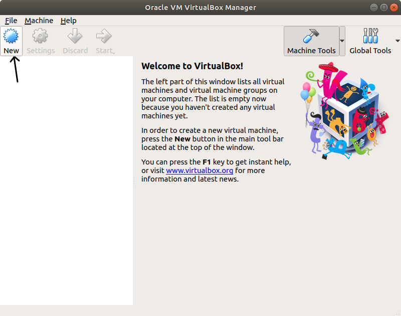
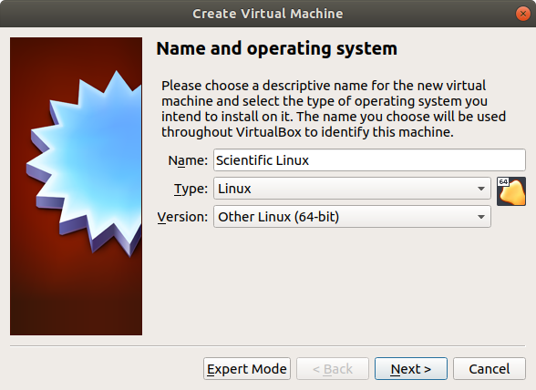
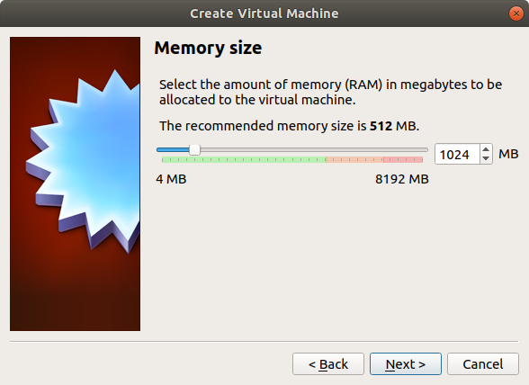
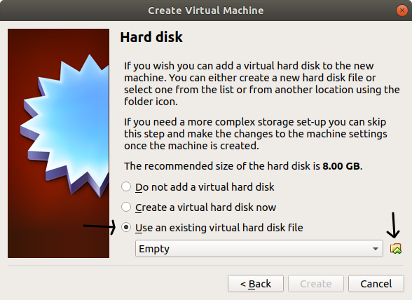

# Setting up a Scientific Linux Virtual Machine

First, obtain a Scientific Linux virtual machine from [this link](https://www.osboxes.org/scientific-linux/).
Be sure to note the user and root passwords.
You may have to unpack the file.

Also download and install [VirtualBox](https://www.virtualbox.org/)

## Initialize the virtual machine

1. Run VirtualBox and create a new virtual machine:

2. Choose appropriate name and OS type:

3. Give the virtual machine some memory (no less than 1025MB)

4. Choose the `Use an existing virtual hard disk file` option, and browse to the virtual machine image you downloaded (with extension `.vdi`)

5. Click finish and you're good to go

## Installing Guest Additions

To interact better with the host system, guest additions should be installed.

1. Update the kernel (in a terminal)

    * `sudo yum update kernel`

2. Reboot the virtual machine

3. Install kernal headers

    * `sudo yum install kernel-devel-$(uname -r) kernel-headers-$(uname -r)`

4. Install other packages

    * `sudo yum install gcc make perl`

5. install guest additions:

    * In the virtual machine menu:
        * `Devices -> Insert Guest Additions CD image`	(you may be prompted to download it)

6. When prompted by VMachine, choose 'run'

    *if not prompted:
        * Right click on the CD icon on the desktop
        * Choose 'Open in terminal'
        * run `sudo su`
        * run `./autorun.sh`

7. Enter root password
8. Once the installation is complete, restart the virtual machine

## Passing CAEN digitizer to Virtial Machine

todo
